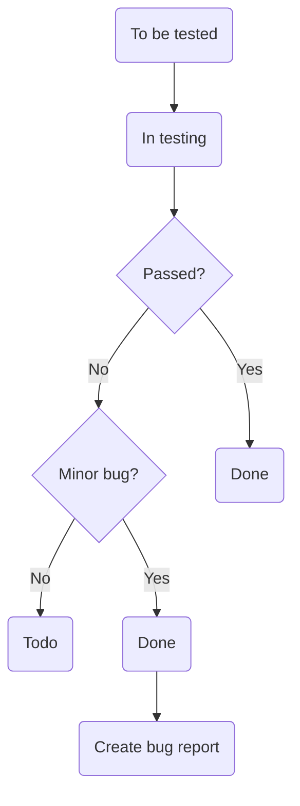

# 1.Introduction
The purpose of the test strategy for the Smartscapes is to:
- Provide a central artifact to govern the strategic approach of the test effort;it defines the general approach to be employed when testing the software and when evaluating the results of that testing.Planning artifacts will refer to the test strategy regarding the governing of detailed testing work
- Provide visible confirmation to test-effort stakeholders that adequate consideration has been given to governing the test effort and, where appropriate, to have those stakeholders approve the strategy.

## Analogues 

- AllTrails
- Strava
  
## Used technologies 
- Backend
  - Fastify — a backend framework, Knex — a query builder, Objection — an ORM, Typescript
- Database
  - PostgreSQL
- Frontend
   - React— a frontend library, Redux + Redux Toolkit — a state manager,  Typescript
- Github actions are used for CI and CD.
- Scrum model of SDLC.
## Documents
- Design — Figma
- Specification — Specification
- Repository  — Repository
## Project team
The team that will work on the project: 
- developer team (10);
- QA team (2);
- 3 coaches of the developer team;
- 1 mentor of the QA team;
- Product Owner 
## Project deadlines
- 21/07/2025 - project starts;
- 30/08/2025 - release.
- All works must be completed before 30/08/2025.  

## Communications approach
Testers can communicate:
- with questions that arise during the development to mentor and coaches;
- with questions about the product to the product-owner before the demo;
- with any technical questions to the development team.

## 2.Test Approach
A proactive approach will be used in the testing - an approach in which the test design process is initiated as early as possible in order to find and fix the defects before the build is created.
- Manual testing
- Automated testing (Optional)

Automated testing will cover all high-level features (only API tests should be automated).

## Types of Testing 
The following types of testing will be used:
- Functional testing
- User interface testing
- Smoke testing
- Regression testing
- Acceptance testing

## Priorities for test activities

Priority
Responsibility
Purpose
Highest
In the presence or appearance of new tasks with the “Needs-qa-review” label, analyze and review the requirements for these tasks and discuss them with the product owner.
Further transfer of the task with correct and detailed requirements to the developer for implementation. Proper planning of the test strategy and creation of appropriate test documentation
High
In the presence or appearance of new tasks in the “To Be Tested” assign an work on them due to the prepared test documentation
Timely performance of assigned tasks by the QA Engineer and Developers within the schedule of testing and development of the product
High
Completion of assigned tasks from the “In Progress” section. Checking the fixed bugs from the “To Be Tested” section
Timely performance of assigned tasks by the QA Engineer and Developers within the schedule of testing and development of the product
Major
In the absence of tasks with the highest and high priority, work on creating new and/or improving existing test documentation
QA process improvement of the product

Weekly objectives for QA team
Analyze new feature requirements and clarify acceptance criteria
Perform manual testing of new features and bug fixes
Prioritize defects based on severity and impact
Verify resolved defects and close verified issues
Maintain and update test documentation as needed
Develop automated tests as time and resources allow

## Using templates

#### Bug Report Template: 

1. Summary
2. Environment
3. Steps to reproduce
4. Actual Result
5. Expected Result
6. Visual Proof (screenshots, videos, text)
7. Severity
   
### User Story template:
1. Background
2. Idea  
    As a (ROLE), I want to (ACTION) so that I can (VALUE/OUTCOME)
3. Acceptance criteria

### Checklist Template: 
1. №
2. Application name
3. Test case ID
4. Status (Passed, skipped, Failed, Not Run)
5. Notes
6. Bug

### Test Case Template:
1. ID
2. Feature
3. Description
4. Preconditions
5. Test data
6. Steps
7. Expected result

# 3.Test Environment
- Setup required for the test environment:

Browser: 
-Google Chrome (latest) 
-Mozilla Firefox (Latest) (Optional) 
-Safari (Latest) (Optional) 

Display resolution: 
-Desktop: 1920×1080 (Full HD) 
-Tablet: 800×1280  
-Mobile: 375×667 (iPhone SE) 
Supported range: 320×568 (minimum, small mobile) to 1920×1080 (maximum, full HD desktop)

Display orientation:  
-Desktop/Laptop: Landscape 
-Mobile: Portrait and Landscape 

Localization of the project: 
-English (en) 

- Number of environments are defined by coaches on each project  

Number of environments:   
-Local (local) 
-Development (dev) 
-Production (prod) 

# 4.Testing Tools and Artifacts

- Testing artifacts for the Project:
All artifacts should be published on the Github project board

-Test strategy, 
-Project Test plan (optional, it creates for specific release), 
-Mind map, 
-Checklist, 
-Bug reports, 
-Traceability matrix (optional), 

- Defect Life Cycle:

Severity: 
Critical – Critical Impact/System Down. Complete system outage. 
Major – Significant Impact/Severe downgrade of services. 
Minor – Minor impact/Most of the system is functioning properly. 
Trivial – Low Impact/Informational. 

- Automated testing (optional):  
We will use Postman (TS, playwright). 
We will use GIT hub actions for CI/CD. 

# 5.Release Control    
The project workspace is organized on the Github project board: 
GitHub is used as a code hosting platform for version control and collaboration for this project.  
  - Testing entry criteria: 
-the testing process begins at the requirements' analysis stage, 
-control of the design process at the stage of developing a system project, 
-fulfillment of acceptance criteria of the tickets. 
- Testing exit criteria: 
-all works must be completed not later than: 30/08/2025, 
-fixed 95% of found defects, with no blocking, critical and high severity, 
management decision.

# 6. Additional Procedures
To improve the testing process next additional procedures are needed:
- Meetings: 
-Daily SCRUM team meeting; 
-QA mentor meeting; 
-QA team meetings (optional); 
-Weekly demo with PO. 

- Work review: 
-Weekly review of test artifacts with QA mentor. 
-Sprint retrospective with QA team. 

- Testing team:
  Responsibilities of each QA team member: 
-writing test documentation; 
-specification analysis; 
-manual testing; 
-API testing (manual or automated); 
-Report bugs and errors to development teams. 

# 7. Common risks

| Risk | Probability | Impact | Mitigation Plan | Responsible for mitigation |
|------|-------------|--------|-----------------|----------------------------|
| The testing schedule is tight. If the start of the testing is delayed due to design tasks, the test cannot be extended beyond the UAT scheduled start date. | High | High | The testing team can control the preparation tasks (in advance) and the early communication with involved parties. Some buffer has been added to the schedule for contingencies | QA Engineer |
| Not enough resources, resources onboarding too late | Medium | High | Holidays and vacations should have been estimated and built into the schedule | Developer, QA Engineer, PM |
| Defects are found at a late stage of the cycle; defects discovered late are most likely due to unclear specifications (or their absence) and are time-consuming to resolve. | Medium | High | Ensure prompt communication and fixing of issues. Timely analysis of requirements and development of clear and unambiguous acceptance criteria | Developer, QA Engineer, PM |
| Adding new points/features to completely defined scope | Medium | Medium | Timely analysis of requirements and development of clear and unambiguous acceptance criteria | Developer, QA Engineer, PM |
| Natural disasters/emergency situations | Low | Medium | Remote work is allowed, which allows one to quickly respond to emergency situations and continue work | PM |
| Illness or vacation of a team member | Medium | High | Provision has to be made for the temporary assignment of duties to another competent specialist. Correct planning of all processes. Prioritization of testing | Developer, QA Engineer, PM |
| Incorrect implementation of complex new product logic | Medium | High | Timely analysis of requirements and development of clear and unambiguous acceptance criteria | Developer, QA Engineer, PM |
| Problems with support for various browser and OS combinations | Medium | Medium | Compatibility testing | QA Engineer |
| Difficulties with the usability of new application functionality | Medium | Medium | Cooperation with designers, creation of a focus group during the development of functionality | Developer, QA Engineer, PM |
| Lack or insufficient knowledge of the tool or software | Medium | High | This may cause a delay in meeting product testing deadlines. It requires analysis of technical documentation and planning of the testing process with the necessary list of used tools and programs, with further consideration of the preparatory and training period during the estimation process and adding to the schedule. The use of code reviews between developers, ensuring the presence of a mentor at the initial stages of getting to know the programs | Developer, QA Engineer, PM |
| Delayed testing due to new Issues | Medium | High | Timely analysis of requirements and development of clear and unambiguous acceptance criteria. If new defects are discovered, the defect management and issue management procedures are in place to immediately provide a resolution. | Developer, QA Engineer, PM |
| Reporting issues takes too much time | Very High | High | 1. New feature testing should be performed asap for related tasks in the “To be tested” Column so that developer won’t have to waste much time on recalling the implementation. 2. New feature testing should be performed until all issues are fixed with direct reporting to the Developer | QA Engineer |
| Late QA onboarding OR Testing takes too much time | High | Critical | 1. Involve previous QAs for faster onboarding. 2.1 Involve Dev team for testing OR 2.2 Involve extra QAs for testing | QA Engineer, PM |
| QA is unavailable/busy with other priorities | Moderate | Critical | Make sure to properly prioritize the testing activities | QA Engineer, PM |
| Developer is unavailable/busy with other priorities | Low | High | Try shielding developers from lower priority stuff | QA Engineer, Developer, PM |

# 8. Test Plan (link to document)

Link to the Test plan:

Test plan document should be composed by QA team
It must contain:

Feature priorities 
-Team availability hours 
-Test approach (backend/frontend decomposition) 
-What will we automate? On what level? 
-Features planned 
-Features implemented 
-Demo date / final scope 

